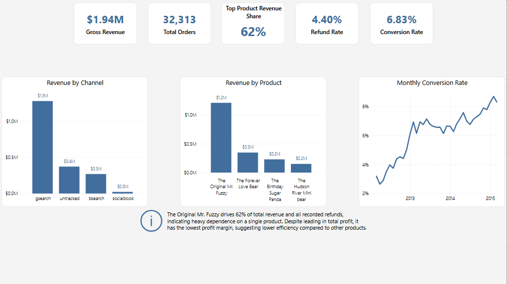
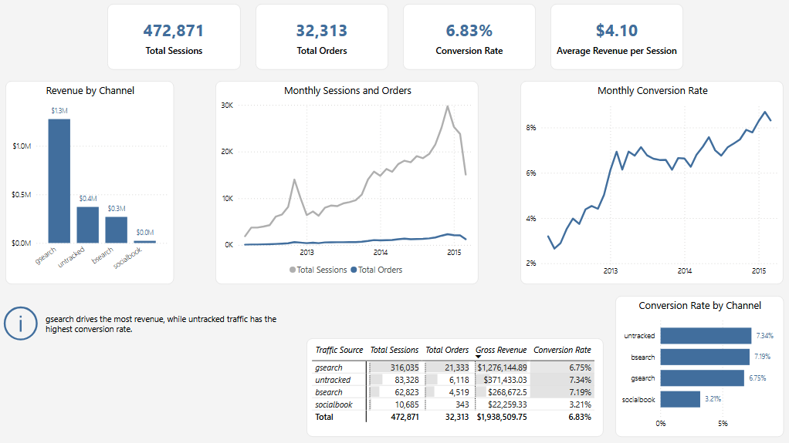
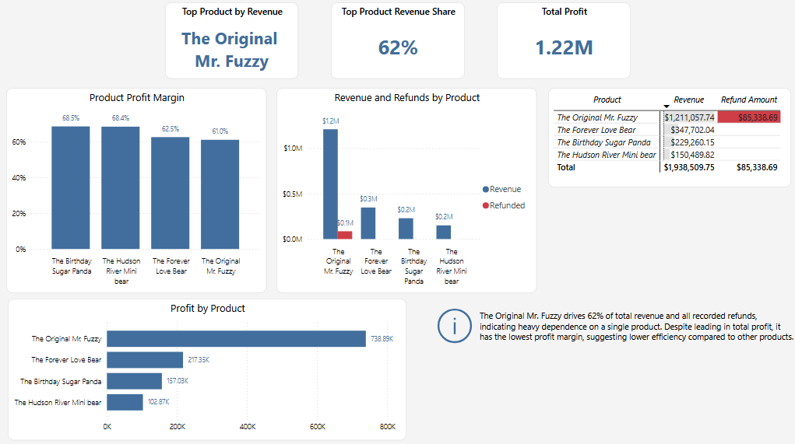

# Toy Store E-Commerce Performance Analysis (Power BI)

## Project Overview
This project analyzes e-commerce performance across marketing, product, and overall business metrics using Power BI.

The dashboard focuses on:

- Revenue and order performance  
- Marketing channel effectiveness  
- Conversion behavior over time  
- Product-level profitability and risk  
- Revenue concentration across products  

The goal was to build a multi-page dashboard that supports both executive reporting and deeper analysis.

---

## Dataset
The dataset includes:

- Website sessions and traffic sources  
- Customer orders and order items  
- Product information  
- Refund data  

Key fields include:

- `website_session_id`, `order_id`, `product_id`  
- `utm_source`, `created_at`  
- `price_usd`, `cogs_usd`, `refund_amount_usd`  

---

## Data Model
The model connects website traffic, orders, and product data.

Key relationships:

- WebsiteSessions ↔ Orders via `website_session_id`  
- Orders → OrderItems → Refunds  
- Products → OrderItems  
- Calendar → WebsiteSessions (drives time analysis)  

This structure enables both channel attribution and product-level analysis.

---

## Key Metrics

- Gross Revenue  
- Total Orders  
- Conversion Rate  
- Refund Rate  
- Total Profit  
- Product Profit Margin  
- Top Product Revenue Share  

---

## Dashboard Pages

### Executive Overview
- KPI summary of revenue, orders, conversion rate, refund rate, and product concentration  
- Revenue by channel and product  
- Conversion trend over time  
- Key business insight  

---

### Marketing Performance
- Traffic and conversion metrics  
- Revenue by channel  
- Conversion rate by channel  
- Sessions and orders over time  

---

### Product Performance
- Revenue and profit by product  
- Product profit margin  
- Refund analysis  
- Top product contribution and risk  

---

## Key Insights

- Revenue reached **~$1.94M** with a **~6.83% conversion rate**  
- gsearch drives the majority of revenue  
- untracked traffic has the highest conversion rate  
- The Original Mr. Fuzzy generates **~62% of total revenue**  
- The same product accounts for all recorded refunds  
- Despite highest profit, it has the lowest profit margin → lower efficiency  

---

## Tools Used

- Power BI  
- DAX  
- Power Query  

---

## Dashboard Preview

### Executive Overview

### Marketing Performance

### Product Performance

---
